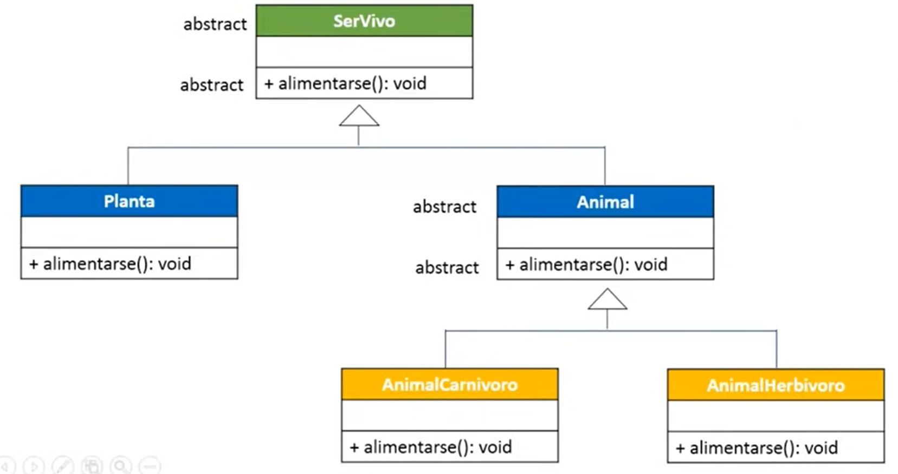

# ClasesAbstractas
Ejemplo didáctico de lo que son las clases abstractas.

This example presents the use of abstract classes. The diagram illustrates the classes and methods implemented. In addition, there is a menu with the options of:

1. Show abstract classes.
2. Print object instantiation.
3. Exit the program.

